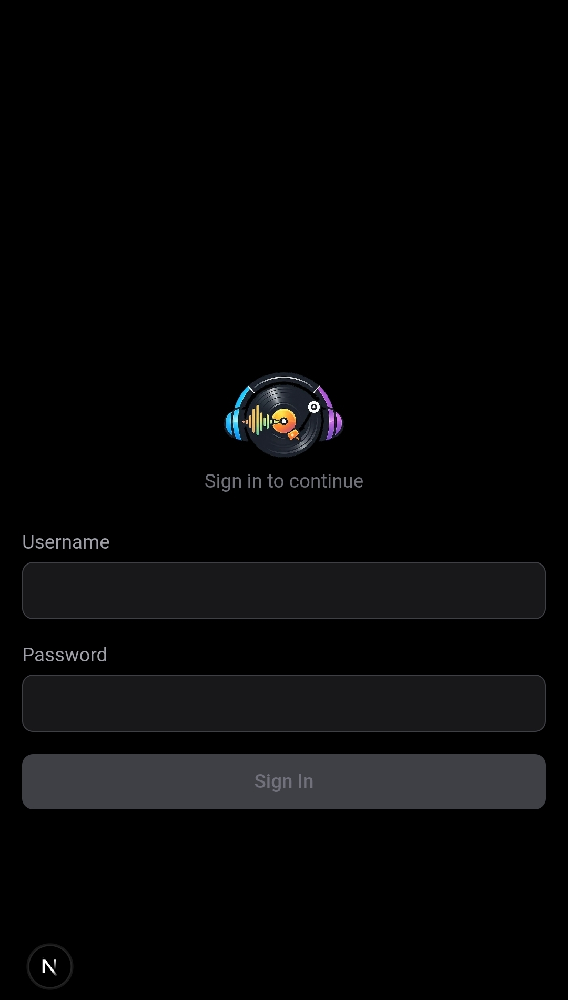
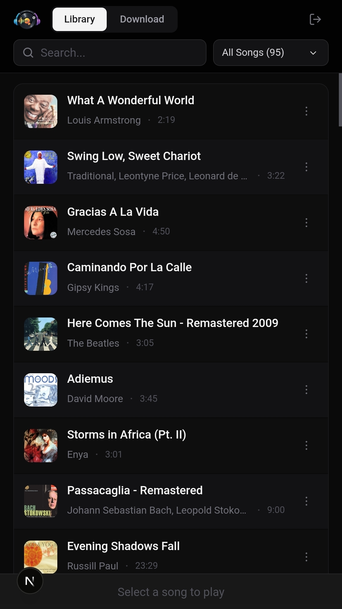
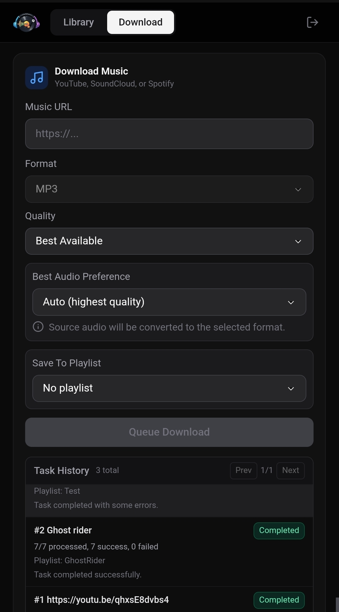

#  EchoDeck

Self-hosted music platform and downloader. Download from YouTube, SoundCloud, and Spotify, then stream from your own library.

## Preview

<table>
  <tr>
    <td></td>
    <td></td>
  </tr>
  <tr>
    <td></td>
    <td></td>
  </tr>
</table>

## Quick Start (Local)

```bash
cp .env.example .env
# Generate a JWT secret and paste it into .env:
node -e "console.log(require('crypto').randomBytes(32).toString('hex'))"

npm install
npm run dev
```

Open `http://localhost:3000`, create your admin account, and start downloading.

Notes:
- `.env.example` sets `ENABLE_AUTO_SETUP=1`, so `npm install` runs binary setup automatically.
- If auto-setup is disabled, run `npm run setup` manually.
- To verify installed tool versions, run `npm run check-deps`.

## Docker (Production)

```bash
cp docker-compose.example.yml docker-compose.yml
export JWT_SECRET=$(node -e "console.log(require('crypto').randomBytes(32).toString('hex'))")
export SETUP_SECRET=$(node -e "console.log(require('crypto').randomBytes(24).toString('hex'))")
docker compose up --build
```

Use `docker-compose.example.yml` as the committed template.
Your local `docker-compose.yml` is intentionally gitignored and can contain private domain/reverse-proxy settings.
`docker-compose.yml` requires `JWT_SECRET` and `SETUP_SECRET` for startup.
On container start, the image runs `npm run setup` automatically so `yt-dlp` and `spotdl` are installed before the app serves requests.

## Environment Variables

| Variable | Required | Description |
|---|---|---|
| `DATABASE_URL` | Yes | SQLite path (default: `file:./dev.db`) |
| `JWT_SECRET` | Yes | Secret for signing auth tokens |
| `SUBSONIC_PASSWORD_KEY` | No | Optional dedicated key for encrypted Subsonic password auth secret storage (falls back to `JWT_SECRET`) |
| `TRUST_PROXY` | No | Set to `1` only behind a trusted reverse proxy (enables forwarded IP headers for login rate limiting) |
| `DOWNLOAD_TASK_MAX_WORKERS` | No | Max concurrent detached download workers (default: `4`) |
| `EXPORT_LRC_SIDECAR` | No | Set `1`/`true` to export `.lrc` lyrics sidecar files next to downloaded audio |
| `DOWNLOAD_ASCII_FILENAMES` | No | Set `1`/`true` to normalize new downloaded folder/file names to ASCII |
| `SETUP_SECRET` | Production | Required in production to protect first-user setup |
| `TASK_SSE_POLL_MS` | No | SSE poll interval for live task updates (minimum: `2000`) |
| `TASK_SSE_MAX_CLIENTS` | No | Max concurrent clients for `/api/tasks/stream` |
| `TASK_DETAIL_SSE_MAX_CLIENTS` | No | Max concurrent clients for `/api/tasks/[id]/stream` |
| `LIBRARY_SCAN_MAX_WORKERS` | No | Max concurrent library scan workers (default: `1`) |
| `LIBRARY_SCAN_INTERVAL_MINUTES` | No | Auto-scan interval in minutes (`0` disables scheduler) |
| `LIBRARY_SCAN_WATCH` | No | Set `1` to enable filesystem watch-triggered scans |
| `LIBRARY_SCAN_WATCH_REFRESH_MS` | No | Watcher refresh interval in ms (default: `300000`) |
| `SPOTIFY_CLIENT_ID` | No | Spotify API client ID |
| `SPOTIFY_CLIENT_SECRET` | No | Spotify API client secret |
| `SPOTIFY_AUTH_TOKEN` | No | Explicit Spotify web token override |
| `TIDAL_BASIC_AUTH` | No | Tidal API auth credential (required to enable Tidal provider matching) |
| `TIDAL_TOKEN_HEADER` | No | Tidal token header value (required to enable Tidal provider matching) |
| `QOBUZ_APP_ID` | No | Qobuz app id (required to enable Qobuz provider matching) |
| `QOBUZ_LOGIN_EMAIL` | No | Qobuz login email (required to enable Qobuz provider matching) |
| `QOBUZ_LOGIN_PASSWORD_MD5` | No | Qobuz password MD5 hash (required to enable Qobuz provider matching) |
| `AMAZON_API_KEY` | No | Amazon API key (required to enable Amazon provider matching) |
| `ENABLE_AUTO_SETUP` | No | Set `1` to allow `postinstall` to auto-download binaries |
| `YTDLP_VERSION` | No | Pin yt-dlp release version/tag (e.g. `2025.02.19`) |
| `SPOTDL_VERSION` | No | Pin spotdl release version/tag (e.g. `4.2.11` or `v4.2.11`) |
| `YTDLP_SHA256` | No | Expected SHA-256 for downloaded `yt-dlp` binary |
| `SPOTDL_SHA256` | No | Expected SHA-256 for downloaded `spotdl` binary |

Run `npm run validate-env` to check your configuration.

## Scripts

| Command | Description |
|---|---|
| `npm run dev` | Start dev server |
| `npm run build` | Production build |
| `npm run start` | Start production server |
| `npm test` | Run tests |
| `npm run test:watch` | Run tests in watch mode |
| `npm run test:integration` | Run end-to-end API smoke test against a running app |
| `npm run test:diagnostic` | Run slower DB/network diagnostic integration tests |
| `npm run subsonic:smoke` | Run Subsonic compatibility smoke checks (requires env vars) |
| `npm run typecheck` | TypeScript type check |
| `npm run lint` | ESLint |
| `npm run setup` | Install/verify required downloader binaries |
| `npm run check-deps` | Verify external runtime dependencies |
| `npm run artwork:refresh` | Rebuild low-res artwork cache |
| `npm run validate-env` | Verify required env vars |
| `npm run db:push` | Sync Prisma schema to database |
| `npm run db:generate` | Regenerate Prisma client |
| `npm run db:backfill-ownership` | Backfill legacy rows with missing ownership |
| `npm run db:verify-ownership` | Fail if any rows still have missing ownership |
| `npm run db:backfill-playlist-entries` | Backfill playlist join entries from legacy song playlist links |
| `npm run db:ensure-subsonic-tokens` | Ensure each user has a Subsonic token |
| `npm run db:organize-layout` | Dry-run local file layout normalization and DB path updates |
| `npm run db:organize-layout:apply` | Move files to normalized layout and persist DB path changes |
| `npm run db:studio` | Open Prisma Studio GUI |

## API Highlights

Core app APIs:
- `GET /api/songs` supports filters for `search`, `source`, `playlistId`, `albumId`, `year`, `genre`
- `PATCH /api/songs/:id` supports playlist assignment and metadata edits
- `GET/POST /api/playlists`
- `GET/POST /api/users` and `PATCH /api/users/:id` (admin only)
- `POST /api/auth/logout-all` (invalidate all existing sessions for current user)

Playback state:
- `GET/PUT /api/playback/session`
- `PUT /api/playback/queue`
- `POST /api/playback/queue/reorder`

Library scanning:
- `GET/POST /api/libraries`
- `PATCH /api/libraries/:id/paths`
- `POST /api/libraries/:id/scan` (async default, `?mode=sync` supported)
- `GET /api/libraries/:id/scans`

Metadata browse:
- `GET /api/artists`
- `GET /api/artists/:id/albums`
- `GET /api/albums`
- `GET /api/albums/:id/songs`

Subsonic-compatible endpoints:
- `GET /api/subsonic/rest` (query command mode)
- `GET /api/subsonic/rest/:command.view` (path command mode)
- Supports auth via:
`u` + `p` (plain or `enc:` hex), and standard `u` + `t` + `s`
- Includes: `ping`, `getLicense`, `getOpenSubsonicExtensions`, `getMusicFolders`, `getIndexes`, `getArtists`, `getArtist`, `getArtistInfo`, `getArtistInfo2`, `getMusicDirectory`, `getAlbum`, `getAlbumInfo`, `getAlbumInfo2`, `getSong`, `stream`, `getCoverArt`, `getAvatar`, `getPlaylists`, `getPlaylist`, `createPlaylist`, `updatePlaylist`, `deletePlaylist`, `search`, `search2`, `search3`, `setRating`, `star`, `unstar`, `getStarred`, `getStarred2`, `getBookmarks`, `createBookmark`, `deleteBookmark`, `getShares`, `createShare`, `deleteShare`, `scrobble`, `getNowPlaying`, `getPlayQueue`, `savePlayQueue`, `jukeboxControl`, `getRandomSongs`, `getAlbumList`, `getAlbumList2`, `getGenres`, `getSongsByGenre`, `getTopSongs`, `getLyrics`, `getLyricsBySongId`, `getSimilarSongs`, `getSimilarSongs2`, `startScan`, `getScanStatus`, `getUser`, `getUsers`
- Smoke test guide: `docs/subsonic-client-smoke-test.md`

## Security

Provider credentials are environment-managed only. Keep them in `.env` or your deployment secret manager and never commit real secrets.

## Legal

This project is distributed for self-hosted use. You are responsible for compliance with:

- Terms of service of source platforms
- Copyright and licensing laws in your jurisdiction
- Any local regulations related to media downloading, caching, and redistribution

## Community

- Roadmap: `docs/echodeck-roadmap.md`
- Release process: `docs/release-process.md`
- Contributing guide: `CONTRIBUTING.md`
- Code of conduct: `CODE_OF_CONDUCT.md`
- Security policy: `SECURITY.md`
